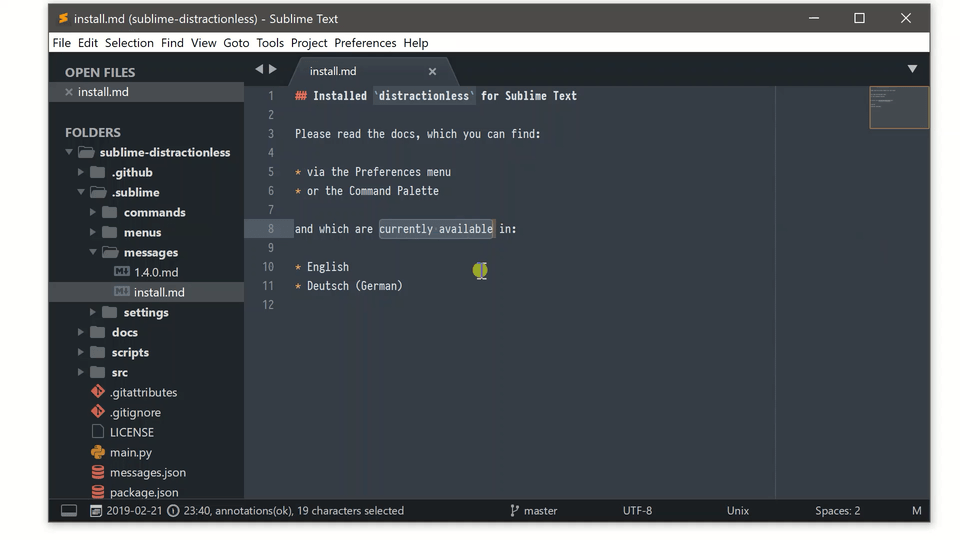

# distractionless Erweiterung für [Sublime Text](https://www.sublimetext.com)

> Das Bildschirmvideo zeigt Adaptive Theme sowie Mariana Color Scheme. Die verwendete Schriftart ist `PragmataPro`.

## Voraussetzungen

distractionless ist als Erweiterung für die **neuste** Sublime Text Version gedacht und erfordert im Moment **Build 4050** oder neuer.

* Lade [Sublime Text](https://www.sublimetext.com) herunter
  * (stable channel)
  * (dev channel)

## Installation

Die Verwendung von **Package Control** wird nicht zwingend vorausgesetzt, aber durchaus empfohlen, da es deine Erweiterungen (mit ihren Abhängigkeiten) aktuell hält.

### Installation über Package Control

* [Installiere Package Control](https://packagecontrol.io/installation#st3)
  * Schließe und öffne Sublime Text nach der Installation von Package Control.
* Öffne die Befehlseingabe (`Tools > Command Palette`).
* Wähle `Package Control: Install Package`.
* Suche nach [`distractionless` in Package Control](https://packagecontrol.io/packages/distractionless) und wähle die Erweiterung aus, um sie zu installieren.

## Verwendung

distractionless lässt Sublime Text automatisch in den [Distraction Free mode](https://www.sublimetext.com/docs/3/distraction_free.html) innerhalb eines normalen Fensters wechseln, sobald du beginnst, eine Datei zu bearbeiten.

distractionless lässt Sublime Text automatisch zurück in den normalen Modus wechseln, sobald:

* du eine Datei speicherst, öffnest oder klonst.
* einen neuen Tab öffnest, den Tab wechselst oder schließt.
* Sublime Text in den Vordergrund wechselt.

### Einstellungen

Verwende die Einstellungen von Sublime Text um anzupassen, wie Ansichten in jedem Modus dargestellt werden:

* `Preferences > Settings`
* `Preferences > Settings - Syntax Specific`
* `Preferences > Settings - Distraction Free`

Verwende die distractionless Einstellungen um anzupassen, wann und was beim Umschalten zwischen den Modi passiert:

* `Preferences > Package Settings > distractionless > Settings`

## Quellcode

[github.com/jrappen/sublime-distractionless](https://www.github.com/jrappen/sublime-distractionless)

### Lizenz

Siehe [`LICENSE`](https://github.com/jrappen/sublime-distractionless/blob/master/LICENSE).

### Feedback

Verwende für Feedback bitte die Befehlseingabe (command palette) oder das Menü.

## Spenden

[paypal.me/jrappen](https://www.paypal.me/jrappen)
